# Movie Surfer App

A mobile-first React application to discover the most popular movies, view details, and explore movie information using the [The Movie Database (TMDB) API](https://www.themoviedb.org/documentation/api).

---

## Description

Movie Surfer presents users with a responsive grid of movie posters. Users can tap a poster to view detailed information, including the original title, poster image, plot synopsis, user rating, and release date. The app is designed for mobile devices and follows best practices for accessibility, performance, and code quality.

---

## Tech Stack

- **React 19** (with TypeScript)
- **Vite** (build tool)
- **Tailwind CSS 4** (utility-first styling)
- **Jest** & **React Testing Library** (unit/component testing)
- **React Router v7** (routing)
- **TMDB API** (movie data)
- **ESLint** (linting)
- **Cypress** (E2E & visual regression, optional)

---

## Installation

1. **Clone the repository:**
   ```sh
   git clone https://github.com/your-username/movie-surfer-app.git
   cd movie-surfer-app/movie-surfer-app
   ```

2. **Install dependencies:**
   ```sh
   npm install
   ```

3. **Set up environment variables:**
   - Copy `.env.example` to `.env` and add your TMDB API key:
     ```
     VITE_REACT_APP_TMDB_API_KEY=your_tmdb_api_key_here
     ```
   - (Do **not** commit your real API key.)

4. **Start the development server:**
   ```sh
   npm run dev
   ```
   The app will be available at [http://localhost:5173](http://localhost:5173) (or as indicated in your terminal).

---

## Testing

### Unit & Component Tests

Run all tests:
```sh
npm test
```

Run tests in watch mode:
```sh
npm run test:watch
```

### End-to-End (E2E) Tests (Optional)

If you want to run Cypress E2E tests:
```sh
npx cypress open
```

---

## Project Structure

- `src/` – Main application source code
  - `components/` – Reusable UI components (MovieGrid, MovieDetails, Header, etc.)
  - `pages/` – Page-level components (Home, MoviePage)
  - `hooks/` – Custom React hooks (e.g., useMovies)
  - `services/` – API service logic
  - `utils/` – Utility functions (e.g., image URL builder)
  - `styles/` – Tailwind and global CSS
  - `types/` – TypeScript type definitions

## Architecture

```mermaid
flowchart TD
  subgraph Pages
    HomePage[HomePage]
    MoviePage[MoviePage]
  end

  subgraph UI_Components["UI Components"]
    Header[Header]
    MovieGrid[MovieGrid]
    MovieDetails[MovieDetails]
    Pagination[Pagination]
  end

  subgraph Hooks
    useMovies[useMovies]
  end

  subgraph Services
    movieApi[movieApi]
  end

  subgraph Utils
    imageUrlBuilder[imageUrlBuilder]
    env[env.ts]
  end

  HomePage --> Header
  HomePage --> MovieGrid
  HomePage --> Pagination
  HomePage --> useMovies

  MoviePage --> Header
  MoviePage --> MovieDetails
  MoviePage --> useMovies

  useMovies --> movieApi

  movieApi --> env

  MovieGrid --> imageUrlBuilder
  MovieDetails --> imageUrlBuilder
```



---

## Notes

- **API Key:** You must provide your own TMDB API key in the `.env` file.
- **Accessibility:** The app uses semantic HTML and ARIA roles for accessibility.
- **Mobile-First:** The layout and grid are optimized for mobile devices.
- **Testing:** Includes unit/component tests for main features and logic.

---

## License

This project is for educational/non-commercial use only.  
See [The Movie Database API Terms of Use](https://www.themoviedb.org/documentation/api/terms-of-use) for API usage restrictions.

---
